# Battleships

Battleships is a classic two-player strategy game where the objective is to sink the opponent's fleet of ships before they sink yours. 

Each player takes turns guessing the locations of the opponent's ships.

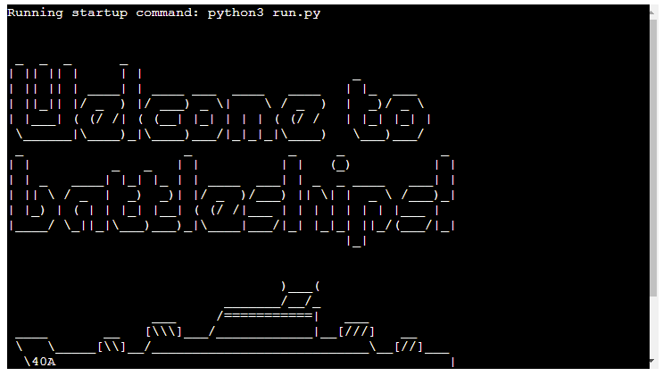

View the live project here... (https://norfolk-battleships-5a38836fbaac.herokuapp.com/)

## Table of Contents
### [How to play](#how-to-play-1)
### [User Experience (UX)](#user-experience-ux-1)
* [User Stories](#user-stories)
### [Features](#features-1)
* [Existing Features](#existing-features)
### [Features Left to Implement](#features-left-to-implement-1)
### [Technologies Used](#technologies-used-1)
### [Frameworks, Libraries & Programs Used](#frameworks-libraries--programs-used-1)
### [Testing](#testing-1)
### [Manual Testing](#manual-testing-1)
### [Fixed Bugs](#fixed-bugs-1)
### [Deployment](#deployment-1)
* [Deployment to Heroku](#deployment-to-heroku)
* [Forking the GitHub Repository](#forking-the-github-repository)
* [Local Clone](#local-clone)
### [Credits](#credits-1)
* [Code](#code)
* [Content](#content)
### [Acknowledgements](#acknowledgements-1)

## How to Play

In this version of battleships, the player's oponent is the computer.
The rules and objective are displayed upon entering the player's name.
The player then has to guess where the computer's ships are before the computer guesses all of theirs.

## User Experience (UX)

Battleships offers a compelling mix of strategy and chance. Its user-friendly interface, real-time feedback, and clear visual representations make it accessible and enjoyable for players of all ages. The game fosters logical thinking, strategic planning, and provides an engaging way to test the player's tactical skills against the computer. 

### User Stories

* First-time visitor goals
    * Understand how the game works, the rules and the objective.
    * Play the game.
    * Enjoy the experience. The battleships game should be engaging and fun for the player.

* Returning visitor goals
    * Continue playing. The returning visitor may have enjoyed playing the game and wants to play again.
    * Share with friends. Inviting friends to give the game a try.

* Frequent user goals
    * Improving their accuracy over time.
    * Attempting to win the game in less guesses each time to challenge themselves.

---

## Features

* ASCII art to welcome the player, and win and lose messages in the same theme.
* Player interaction and interface, name input and input prompts keep the user engaged.
* Board setup and display shows the user visually where they're guessing and where the computer is guessing.
* Turns for the player and the computer, with the player given the chance to retake their turn if their first guess was invalid.
* An option to quit the game before a winner is determined.
* Scoreboard displayed after each turn to show who is winning.
* Win and Loss detection and a message displayed to the player in each case.

### Existing Features

* Intro
    * Displays logo and a welcome message.

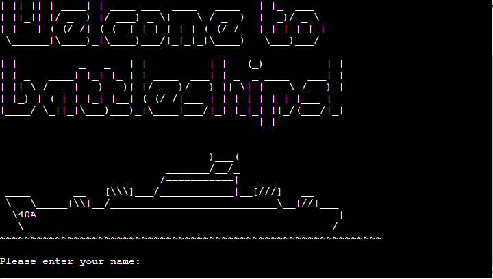

* Enter your name

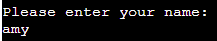

* Rules
    * As soon as a user enters their name, the rules, objecive and a key for symbols used is displayed

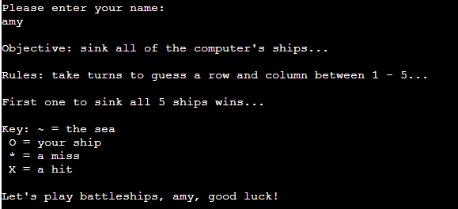

* Good luck message with player's name

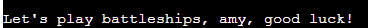

* Player's and computer's boards displayed, with placement of ships visible to player on their own board

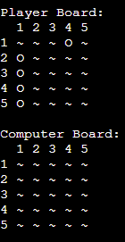

* Prompt user to make a guess, user is prompted to guess a row followed by a prompt to guess a column

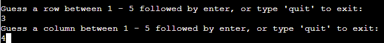

* Quit option to end the game early

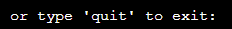

* Hit
    * If the player correctly guesses where a computer's ship is, a hit message is displayed

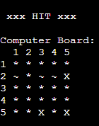

* Miss
    * If player makes an incorrect guess, miss message is displayed

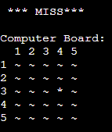

* Computer's board displayed to see where the player guessed

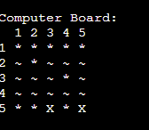

* Computer's guess is displayed, and either a hit of miss message

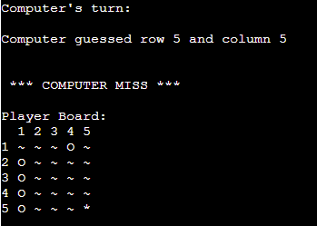

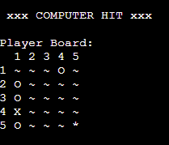

* Player's board displayed

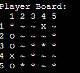

* Scoreboard

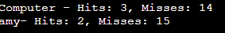

* Player wins

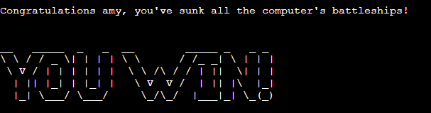

* Computer wins

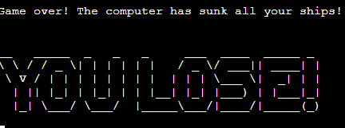

## Features Left to Implement

* Option to chose board size or number of ships, which would make the game easier/harder for the player.
* Differing length of ships to make the game more strategic.
* Two player option.
* Option to restart the game at the end

---

## Design

* Flowchart
    * [Draw.io](http://draw.io/)

---

## Technologies Used

* Python

---

## Frameworks, Libraries & Programs Used

* GitPod
    * To write the code.
* Github
    * Deployment of the website and storing the files online.
* Heroku
    * To deploy the project.
* CI Python Linter
    * Check code for any issues.

## Testing 

CI Python Linter was used to test all code

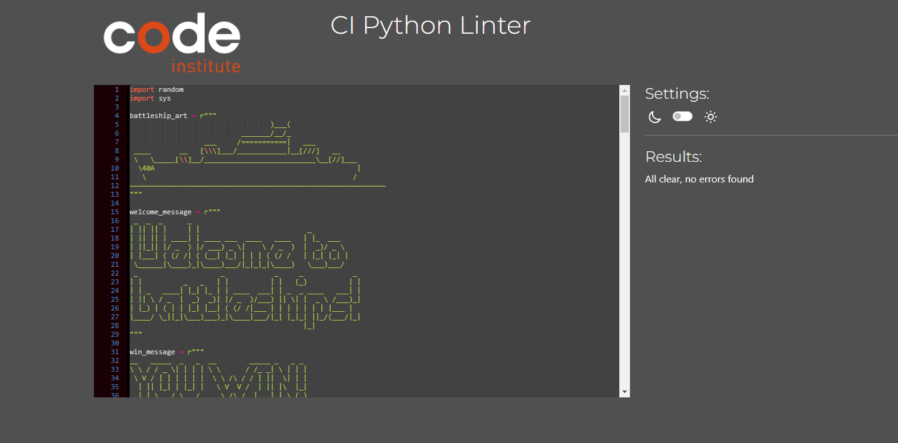

## Manual Testing

The Battleships game underwent thorough manual testing throughout its development. Initially, testing was conducted extensively in the Codeanywhere terminal. Once deployed on Heroku, the game was tested again from start to finish. Key areas tested included rules display, username input validation, coordinate input validation, board display, correct and incorrect guess handling, and the endgame win/loss display. Additionally, the functionality for quitting the game early and replaying was verified to ensure a seamless user experience.

| Feature | Expected Result | Result | How to test | Image |
| ------- | -------------- | ----------- | ------------- | ---------- |
| Welcome | Battleship and "welcome to battleships" is ASCII art|Correct| displayed at the start |  |
| Input name | Prompt for user to enter their name and have it displayed back to them throughout  | Correct |type a name when prompted|  |
| Rules, objective and key | A breif explanation of rules and objectives. Key shows what each symbol on the board means | Correct | displayed after name is given |  |
| Good luck message | To display personalized message | Correct | check the name given is included in the message, use different names |  |
| Add ships  | Randomly add ships to both boards | Correct | restart game multiple times to ensure its random each time | 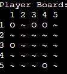 |
| Display both game boards | both boards displayed, ships are visible on player's board but hidden on computer board | Correct | ensure both are labelled correctly and ships are visible according to key |  |
| Guess row and column prompts | Prompts user to guess a row, followed by a column | Correct | type letter 1-5  |  |
| Quit option | An option to end the game early and display goodbye message| Correct | type quit |  |
| Hit a ship  | Display a clear message that a user's guess was correct | Correct | guess correctly |  |
| Missed  | Display clear message that user made incorrect guess | Correct | guess incorrectly |  |
| Invalid input   | Error message to say input is invalid | Correct  | input a number larger than 5 or a letter | 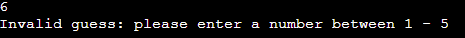 |
| Already guessed  | Error message to say row and column have already been guessed  | Correct | Guess the same row and column again | 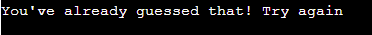 |
| Computer board displayed  | Board displayed to show where the guess landed | Correct | check the guess corresponds to the board |  |
| Computer turn   | computer takes a turn | Correct | Row and column computer guessed displayed |  |
| Computer hit/miss   | Message displayed to show if computer hit or missed | Correct | Hit or Miss displayed |  |
| Player board displayed  | Player board shows where the computer guessed | Correct | check row and column match either hit or miss symbol |  |
| Scoreboard | Keeps track of scores and displayes them after each turn | Correct | Play game |  |
| Win/lose message  | To display win or lose message | Correct | As Expected |  |

## Fixed Bugs

* Fix error in while loop in add ships function
    * The loop didn't correctly track and place ships. I updated it to track the number of placed ships. Stack overflow helped with this issue.
* Fix error calling the function to add ships and add some text to each board
    * I didn't correctly call the function as it was inside a class. The website codearmo explained how.
* Fix error importing random
    * I had orginally had the wrong import that code institute had used, I realised it wasn't working and the website toppr helped explain the fix.
* Fix while loop in play function to just handle hit and miss
    * I moved the function to validate a guess into its own function rather than grouping it with the results of that guess.
* Fix duplication error
    * In classic, clueless-student style, I accidentally duplicated the entire code. 
* Fix issue of not having hits defined correctly
    * I had used hits in the code but hadn't actually defined it yet.
* Fix error in validate guess function
    * The player wasn't getting another attempt at a guess if they entered an invalid or repeated guess
* Fix error in calling play functions
    * I had not called the functions in the play class correctly.
* Fix issue in spelling col/column
    * I had created confusion by not having a uniform way of defining column. I had used both for different variables. I changed all cols to column for clarity.
* Fix error in instructions
    * I had written the instructions first, and as the game progressed and things evolved, I had to update the instructions to match
* Fix error of scope of player name variable
    * I had the variable in a local scope so it could not be accessed elsewhere in the game
* Fix error in computer's turn
    * I hadn't used self correctly here, I updated the computer trun function by retrieving and using the computer's guess with computer_row, computer_column = self.computer_turn(computer_has_guessed). 
* Fix error importing sys
    * I had not realised sys was a different library, geeks for geeks website explained this.
* Fix error in scoreboard, scores were swapped
    * I had confused the player's board and computer's board. 

## Deployment

### Deploying to Heroku

To deploy on Heroku, use the Code Institute Python Essentials Template to enable terminal-based Python code execution in a browser.

1. Log in to your Heroku account or create a new one.
2. From the Heroku dashboard, click "New" and select "Create new app."
3. Choose a unique name for your app and select the appropriate region.
4. Click "Create app."
5. Navigate to the "Settings" tab and locate the "Config Vars" section.
6. Click "Reveal Config Vars" and add a new key-value pair: PORT with the value 8000, then click "Add."
7. Scroll down to the "Buildpacks" section, click "Add buildpack," and select "Python."
8. Repeat step 7 to add "Node.js" as a buildpack, ensuring "Python" appears first in the list.
9. Return to the top and select the "Deploy" tab.
10. Choose GitHub as the deployment method, search for your repository, and link it.
11. Scroll down and opt for either "Enable Automatic Deploys" or "Deploy Branch" to deploy manually.

### Forking the GitHub Repository

By forking the repository, we make a copy of the original repository on our GitHub account to view and change without affecting the original repository by using these steps:

1. Log in to GitHub and find the Battleships Repository.
2. At the top of the repository page, beneath the main navigation, click the "Fork" button.
3. You now have a forked copy of the original repository on your GitHub account.

### Local Clone

To create a local clone of the repository:

1. Log in to GitHub and locate the Battleships Repository.
2. Under the repository name, click the "Code" button.
3. Choose "Clone with HTTPS," "SSH," or "GitHub CLI," and copy the provided URL.
4. Open Git Bash.
5. Navigate to the directory where you want to create the clone.
6. Type git clone followed by the URL copied in step 3.
7. Press Enter, and your local clone will be created.

## Credits

### Code

* All code that was sourced is referenced in run.py: here is the more extensive list
(links are in the order in which they are referenced in my code)

* https://www.toppr.com/guides/python-guide/tutorials/modules/modules/random/use-random-module-to-generate-random-numbers-in-python/
* https://www.geeksforgeeks.org/python-sys-module/
* https://learn.codeinstitute.net/courses/course-v1:CodeInstitute+PE_PAGPPF+2021_Q2/courseware/b3378fc1159e43e3b70916fdefdfae51/605f34e006594dc4ae19f5e60ec75e2e/
* https://stackoverflow.com/questions/67453146/typeerror-in-tic-tac-toe-game-in-python
* https://discuss.codecademy.com/t/excellent-battleship-game-written-in-python/430605
* https://stackoverflow.com/questions/34273507/type-error-when-trying-to-print-row-number
* https://www.w3schools.com/python/python_sets.asp
* https://www.pythonmorsels.com/breaking-long-lines-code-python/

* I gained understanding of python through code institute lessons.
* The book Beginning Python by Magnis Lie Hetland
* Stack overflow

### Content

* All content was written by the developer, unless credited both in run.py and in the above links

## Acknowledgements

 * My mentor Mitko Bachvarov provided helpful feedback.
 * Slack community for encouragement.